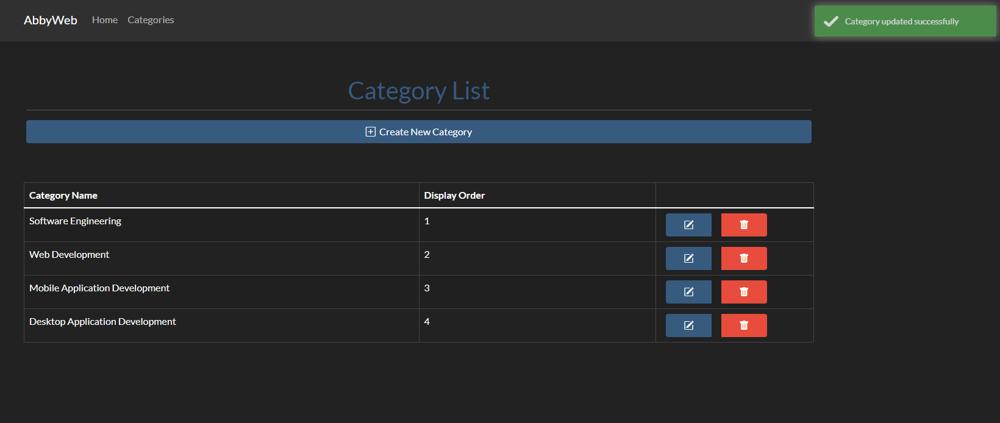

<h1 align="center">ASP.NET 6 CRUD Application</h1>

# Tools Required

Tools Required

- [x] .NET 6
- [x] Visual Studio 2022
- [x] SSMS (SQL Server Management Studio 2018>)

# Instructions

To run on your local pc:

- Clone Repo
- Open the solution in Visual Studio
- Use Microsoft SQL Server Management Server to create a MS SQL Database on your local pc
  - Use this tool to access the database on the local pc
  - Populate the db connection string within `appsettings.json`
  - Run the following command in the Nuget Package Manager terminal to push migrations and seed the MS SQL database:
    - `update database`
  - Run the application in Visual Studio
